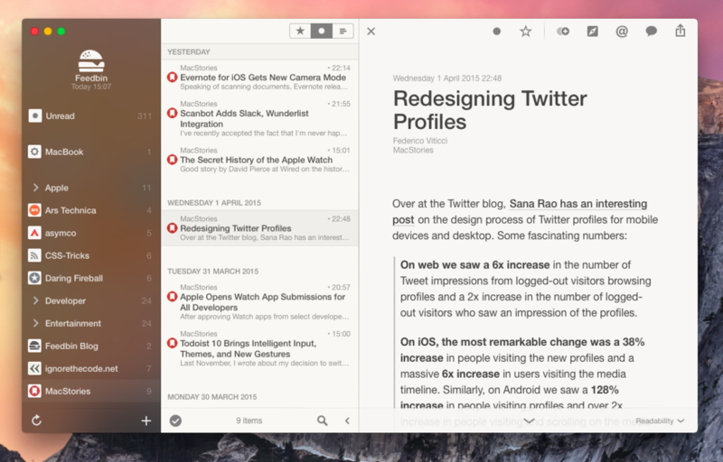
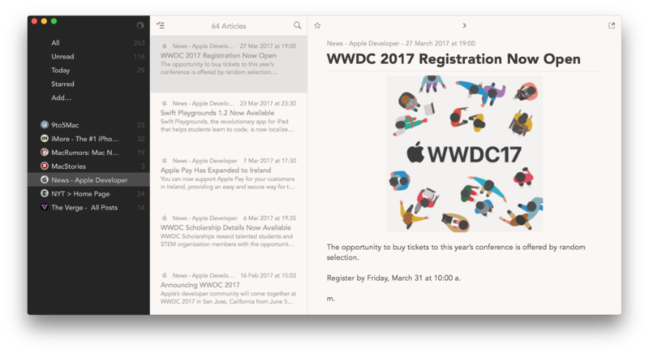

# Curated RSS Feed

The RSS feed reads [Hacker News](https://news.ycombinator.com/), and retrieves a raw copy of the HTML code from each link. Then it passes the HTML code through a content analyzer based on [Readability](https://github.com/cixtor/readability), a port of the original experiment by Arc90 to convert HTML pages into readable content, the same technology used by Safari, Firefox, Pocket, among others.

## Install using Go

You'll need [Go](https://golang.org) and either [Reeder](https://reederapp.com) or [Cappuccino](http://cappuccinoapp.com).

```sh
go get -u github.com/cixtor/rssfeed
```

## Install using Docker

You'll need [Docker Desktop](https://www.docker.com/products/docker-desktop) and either [Reeder](https://reederapp.com) or [Cappuccino](http://cappuccinoapp.com).

```sh
docker-compose up -d
```

## Usage

Use your favorite RSS client to subscribe to http://localhost:9628/news.rss

| Reeder | Cappuccino |
|--------|------------|
|  |  |
